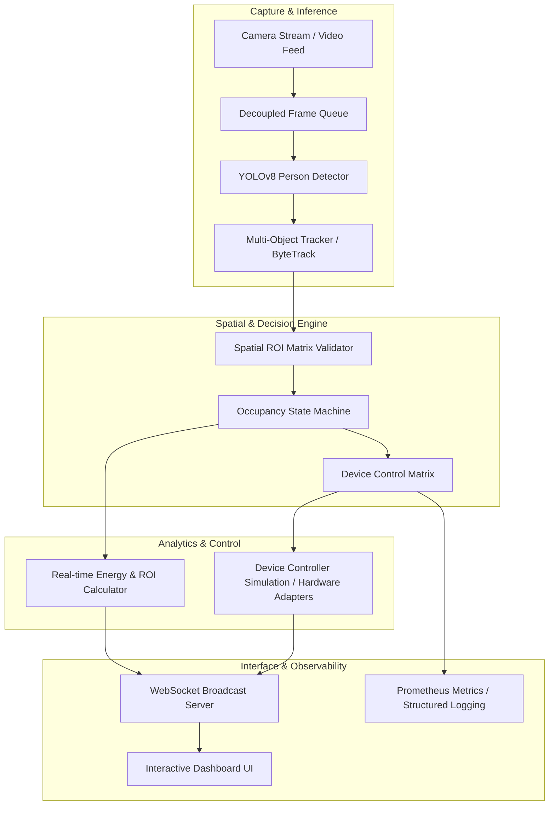

# System Architecture — Vision-Based Smart Energy Saving System

## System Architecture Diagram

## Component Workflow

1. **Camera Feed & Ingestion**: High-rate frames are captured asynchronously and pushed into a bounded frame queue.
2. **YOLOv8 Inference**: The inference worker pulls frames, detects persons, filters confidence thresholds, and extracts bounding boxes/centroids.
3. **Tracking & Spatial ROI**: Bounding boxes are tracked across frames and mapped into predefined spatial regions (e.g., Desk Zone vs Transit Zone).
4. **Occupancy State Machine**: Absorbs transient detection flickers using a **Persistence Window** before initiating countdown timers to declare space **Empty**.
5. **Device Control Matrix & Latency Simulation**: Evaluates per-device rules (Light, Fan, AC), triggers power ramps, handles startup/shutdown latencies asynchronously, and updates states.
6. **Analytics & Dashboard Telemetry**: Calculates cumulative kWh, Cost ($), and CO2e savings while streaming state telemetry via WebSockets to the web control dashboard.
