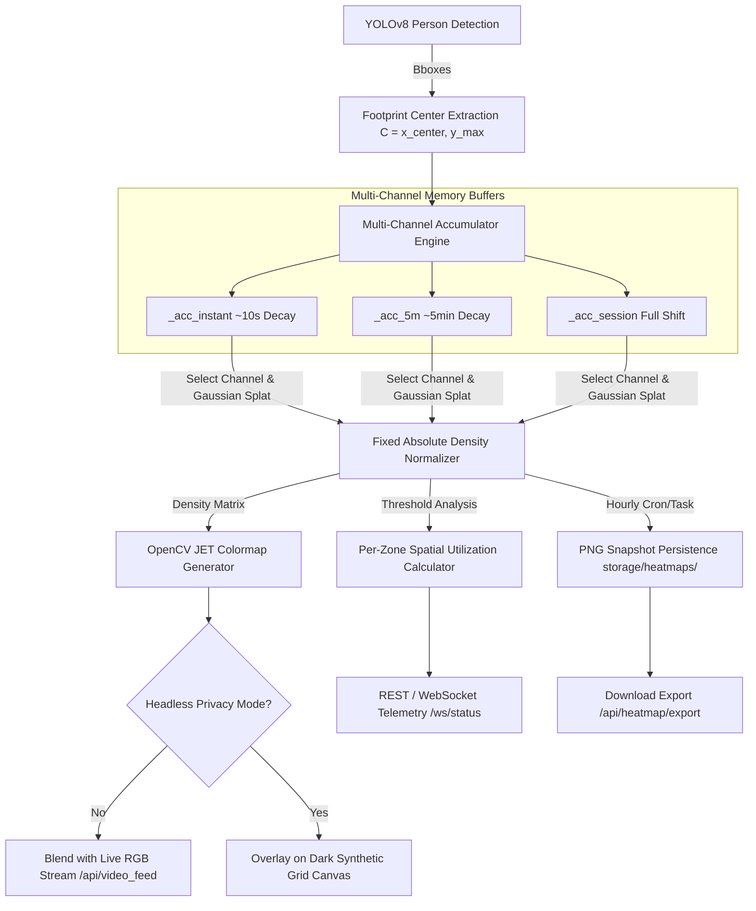

# Feature Plan: Cumulative Spatial Occupancy Heatmap

**Project:** Vision-based Smart Energy-saving System  
**Feature Name:** Cumulative Spatial Occupancy Heatmap Engine  
**Target Modules:** `app/detector/pipeline.py`, `app/api/video_router.py`, `app/config/settings.py`, `app/static/index.html`, `app/static/js/app.js`  
**Status:** Approved & Finalized (Grilling & Domain Alignment Complete)  

---

## 1. Overview & Objectives

### Problem Statement
The current heatmap implementation applies a simple frame-by-frame brightness colormap overlay (`cv2.COLORMAP_JET` on grayscale frame brightness). It does not track occupant movements, dwell times, footprint locations, or spatial activity density over time.

### Solution & Goal
Upgrade the heatmap system to a multi-channel **Cumulative Spatial Occupancy Heatmap**. Instead of visual frame brightness, the detector will accumulate person bounding-box floor footprints over time into multi-window spatial density buffers using 2D Gaussian splatting, exponential temporal decay, fixed absolute density normalization, spatial zone telemetry extraction, and privacy-preserving headless grid rendering.

### Value Delivered
- **Facility Managers**: Identify actual high-traffic corridors, bottleneck areas, and high dwell-time hotspots.
- **Energy Efficiency**: Correlate heatmaps with HVAC/lighting zones to optimize automatic power-off rules for underutilized room sub-zones.
- **Actionable Telemetry**: Expose real-time per-zone spatial utilization percentages and historical shift audit reports.
- **Privacy Auditability**: Allow spatial traffic auditing even when Headless Privacy Mode is enabled.

---

## 2. Technical Architecture & Data Flow

---

## 3. Core Architectural Decisions (Settled Specifications)

1. **Footprint Center Splatting**:
   - For each detected person bounding box $(x_1, y_1, x_2, y_2)$, compute the floor footprint center $C = \left(\frac{x_1+x_2}{2}, y_2\right)$.
   - Add a 2D Gaussian kernel at $C$ with radius $\sigma = 25\text{px}$ into the accumulator buffer.

2. **Fixed Absolute Density Normalization**:
   - Normalize accumulated matrix values against a fixed saturation threshold $T_{max}$ (e.g. 300 person-seconds of continuous presence = 100% Red Saturation).
   - Prevents empty rooms with minor transient activity from visually blowing out to full red.

3. **Multi-Channel Temporal Memory Engine**:
   - Maintain 3 parallel float32 accumulator matrices in `VisionPipeline` (~3.6 MB RAM total):
     - `self._acc_instant` ($\alpha \approx 0.95$, short ~10s window)
     - `self._acc_5m` ($\alpha \approx 0.998$, short-term activity)
     - `self._acc_session` ($\alpha \approx 0.9999$, full shift / session tracking)
   - Enables instantaneous UI window switching with zero re-computation lag.

4. **Spatial Zone Telemetry Expose**:
   - Evaluate spatial utilization rate (%) for each defined spatial zone:
     $$\text{Utilization Rate} = \frac{\text{Count of Zone Pixels with Density } > \text{Threshold}}{\text{Total Pixels in Zone Polygon}} \times 100\%$$
   - Broadcast via `/ws/status` and REST endpoint `/api/heatmap/stats`.

5. **Server-Side MJPEG Parameter Blending**:
   - `/api/video_feed` accepts query parameters: `heatmap=true`, `window=instant|5m|session`, `alpha=0.1..0.7`.
   - Uses OpenCV `cv2.addWeighted` server-side for zero browser GPU overhead.

6. **Privacy-Preserving Headless Grid Mode**:
   - When `headless_mode=True`, heatmap is rendered on top of a dark synthetic grid canvas instead of raw webcam frames, giving full spatial auditing with zero camera privacy exposure.

7. **Persistence & Export**:
   - Automatically persist hourly summary PNG snapshots to `storage/heatmaps/`.
   - Provide REST endpoint `/api/heatmap/export?window=5m` and UI download button.

---

## 4. Detailed Component Implementation Plan

### A. Detector Pipeline (`app/detector/pipeline.py`)
- Initialize `_acc_instant`, `_acc_5m`, `_acc_session` float32 zero matrices matching input frame resolution ($H \times W$).
- In `_inference_loop`:
  - For each detected person box, update all 3 accumulators with Gaussian splatting at $(x_c, y_{max})$.
  - Apply channel-specific temporal decay factors ($\alpha_{instant}$, $\alpha_{5m}$, $\alpha_{session}$).
- Update `get_latest_processed()` and `generate_mjpeg_stream()` to render specified window and alpha blend ratio.
- Implement `get_zone_heatmap_stats()` to compute per-zone spatial utilization percentage.
- Implement `reset_heatmap_accumulator(window='all')`.

### B. API Layer (`app/api/video_router.py`)
- Update `/api/video_feed` route to parse query parameters (`heatmap: bool`, `window: str`, `alpha: float`).
- Add `/api/heatmap/reset` POST endpoint to clear accumulator buffers.
- Add `/api/heatmap/stats` GET endpoint returning spatial utilization rates.
- Add `/api/heatmap/export` GET endpoint returning high-resolution PNG snapshot downloads.
- Add background scheduler task to persist hourly PNG snapshots into `storage/heatmaps/`.

### C. Frontend Dashboard UI (`app/static/index.html` & `app/static/js/app.js`)
- Design Heatmap Toolbar following **Perplexity aesthetic** (rounded-[32px] container, font-black headers, subtle micro-animations, glassmorphism panel):
  - Toggle Switch: `Occupancy Heatmap OFF / ON`
  - Window Dropdown: `Real-time Instant`, `5-Min Density`, `Full Session`
  - Opacity Slider: `10% - 70%`
  - Control Buttons: `Clear Heatmap`, `Export PNG Snapshot`
- Gradient Heatmap Legend: `Low Dwell (Blue)` $\rightarrow$ `Moderate (Yellow)` $\rightarrow$ `High Dwell (Red)`.
- Live Spatial Zone Utilization Cards displaying real-time % coverage per active spatial zone.

---

## 5. Implementation Phasing & Milestones

| Phase | Milestone Description | Target File(s) |
| :--- | :--- | :--- |
| **Phase 1: Core Multi-Channel Engine** | Multi-channel array initialization, Gaussian footprint splatting, decay math, & absolute scaling | `app/detector/pipeline.py` |
| **Phase 2: API & Persistence Engine** | Stream parameter routing, headless dark grid renderer, reset/stats/export endpoints, & hourly PNG saving | `app/api/video_router.py` |
| **Phase 3: Perplexity UI & Telemetry** | Heatmap toolbar, opacity slider, visual legend gradient, & zone spatial utilization cards | `app/static/index.html`, `app/static/js/app.js` |
| **Phase 4: Automated Testing** | Unit tests for accumulator math, decay rates, zone metrics, and export endpoints | `tests/test_heatmap.py` |

---

## 6. Performance & Safety Verification

- **Memory Overhead**: 3 float32 matrices @ $640 \times 480$ consume ~3.6 MB of RAM total.
- **Compute Efficiency**: Gaussian kernel splatting restricted to local ROI around footprint center ($< 0.8\text{ ms}$ processing time per frame tick).
- **Thread Safety**: All matrix operations synchronized under `VisionPipeline._lock`.
