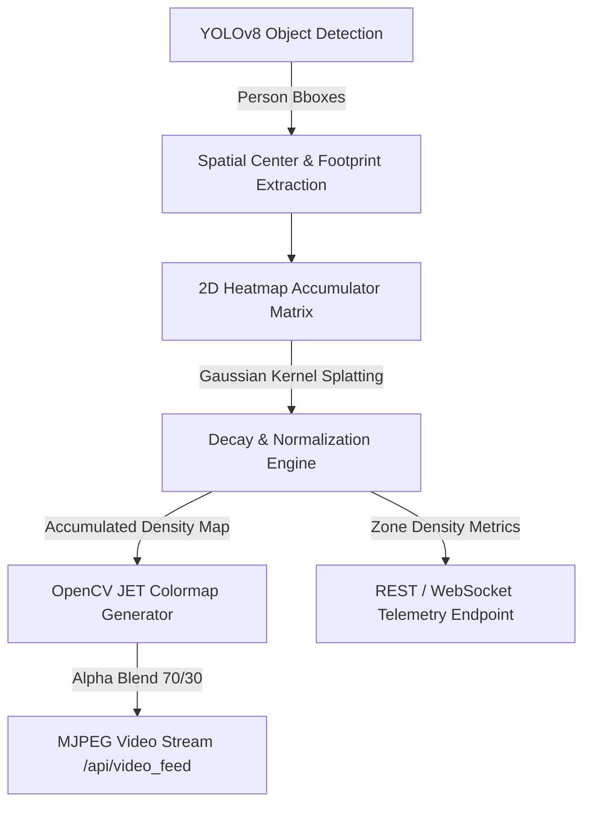

# Feature Plan: Cumulative Spatial Occupancy Heatmap

**Project:** Vision-based Smart Energy-saving System  
**Feature Name:** Cumulative Spatial Occupancy Heatmap  
**Target Modules:** `app/detector/pipeline.py`, `app/api/video_router.py`, `app/static/`  
**Status:** Planned  

---

## 1. Overview & Objectives

### Problem Statement
The current heatmap implementation applies a simple frame-by-frame brightness colormap overlay (`cv2.COLORMAP_JET` on grayscale frame brightness). It does not track occupant movements, dwell times, or spatial activity density over time.

### Solution & Goal
Upgrade the heatmap system to a **Cumulative Spatial Occupancy Heatmap**. Instead of visual frame brightness, the detector will accumulate person bounding-box locations over time into a spatial density matrix buffer.

### Value Delivered
- **Facility Managers**: Identify actual high-traffic corridors and high dwell-time hotspots.
- **Energy Efficiency**: Correlate heatmaps with HVAC/lighting zones to optimize automatic power-off rules for underutilized areas.
- **Actionable Telemetry**: Expose real spatial occupancy statistics to dashboard consumers.

---

## 2. Technical Architecture & Data Flow

---

## 3. Detailed Component Plan

### A. Detector Pipeline (`app/detector/pipeline.py`)
1. **Accumulator Buffer**:
   - Maintain a 2D float32 array `self._heatmap_accumulator` matching frame resolution $(H, W)$.
2. **Spatial Gaussian Splatting**:
   - For each detected person bounding box $(x_1, y_1, x_2, y_2)$, compute the footprint center $C = \left(\frac{x_1+x_2}{2}, y_2\right)$.
   - Add a 2D Gaussian kernel at $C$ with configurable radius $\sigma$.
3. **Temporal Decay Mechanism**:
   - Apply exponential decay $A_{t} = A_{t-1} \times \alpha$ on every frame tick (where $\alpha \approx 0.995$ for smooth decay).
   - Support selectable accumulation windows:
     - **Real-time Instant** (short memory, ~10 seconds)
     - **5-Minute Window** (short-term activity tracking)
     - **Full Shift / Session** (long-term spatial utilization)
4. **Rendering & Normalization**:
   - Normalize accumulator values to range $[0, 255]$.
   - Apply `cv2.applyColorMap(normalized_accumulator, cv2.COLORMAP_JET)`.
   - Blend overlay with live camera frame using `cv2.addWeighted`.

### B. API Layer (`app/api/video_router.py`)
1. Update `/api/video_feed` endpoint to support query parameters:
   - `heatmap=true`
   - `window=instant|5m|1h`
2. Add endpoint `/api/heatmap/reset` to clear accumulator buffer on demand.
3. Expose density telemetry over `/api/heatmap/stats` or existing WebSocket broadcast.

### C. Frontend Dashboard UI (`app/static/index.html` & `app/static/js/app.js`)
1. **Enhanced Heatmap Controls**:
   - Toggle button: `Occupancy Heatmap: OFF / ON`
   - Window Selector Dropdown: `Instant`, `5-Min Density`, `1-Hour Density`
   - Clear Heatmap button.
2. **Visual Legend**:
   - Clean gradient bar showing density scale: `Low Traffic (Blue)` $\rightarrow$ `Moderate (Yellow)` $\rightarrow$ `High Dwell (Red)`.

---

## 4. Implementation Steps & Milestones

| Phase | Task Description | Target File(s) |
| :--- | :--- | :--- |
| **Phase 1: Core Engine** | Implement 2D accumulator, Gaussian splatting, & exponential decay logic | `app/detector/pipeline.py` |
| **Phase 2: API & Controls** | Add window parameters, stream routing, & accumulator reset endpoint | `app/api/video_router.py` |
| **Phase 3: Frontend UX** | Add window selection, density legend, & reset control to dashboard | `app/static/index.html`, `app/static/js/app.js` |
| **Phase 4: Testing & Verification** | Add unit & integration tests verifying accumulator math & rendering performance | `tests/test_heatmap.py` |

---

## 5. Performance & Safety Considerations

- **Memory Overhead**: A single $640 \times 480$ float32 matrix consumes only ~1.2 MB of RAM.
- **Compute Efficiency**: Gaussian splatting limited to ROI around bounding box centers ($< 1\text{ ms}$ processing time per frame).
- **Thread Safety**: All matrix updates protected under existing `VisionPipeline._lock`.
